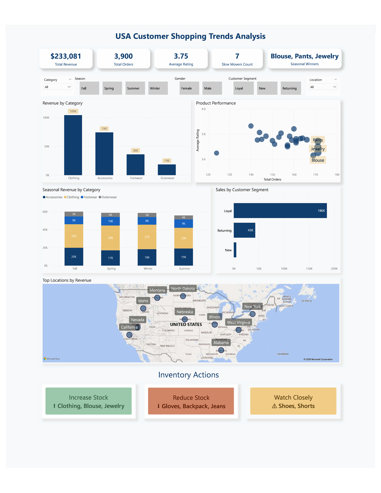
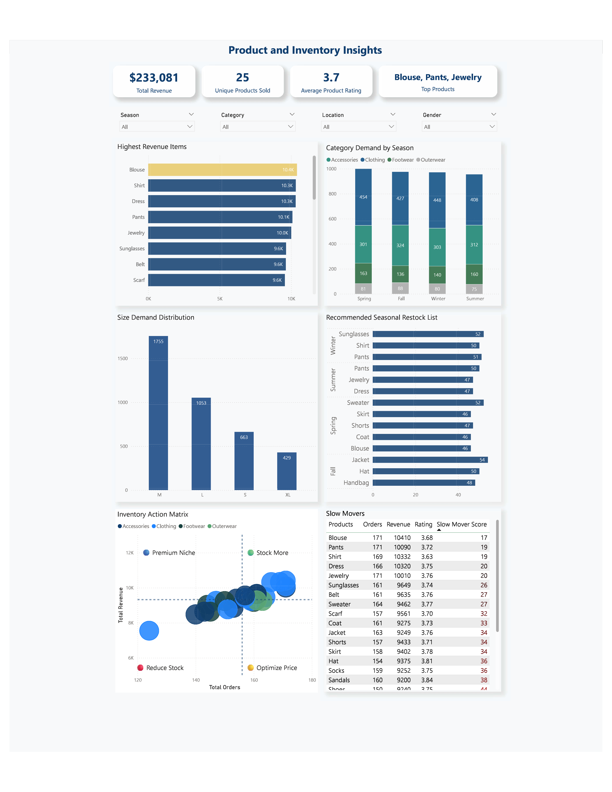
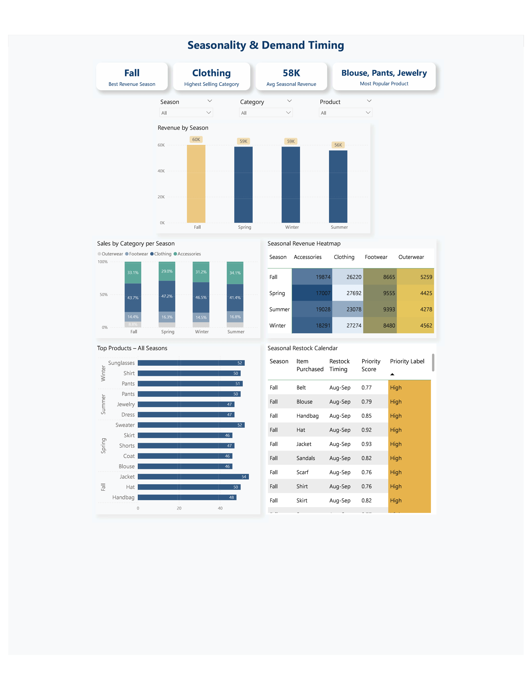
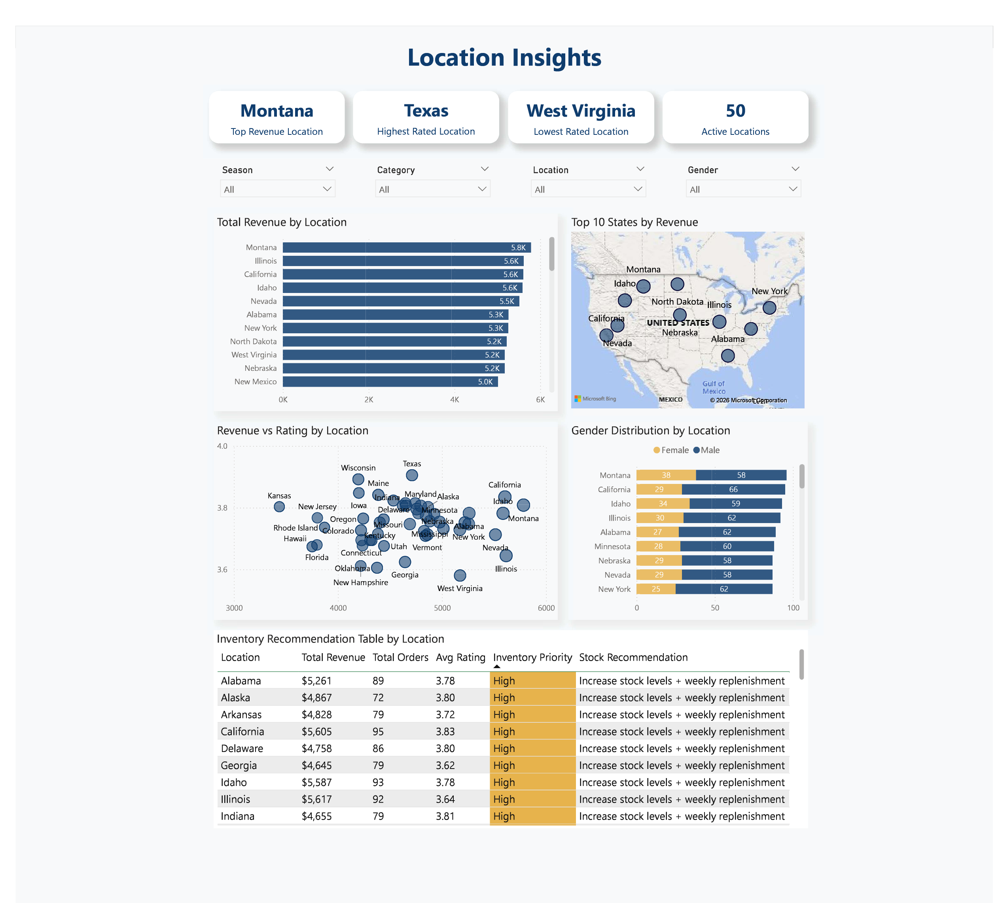

# Customer Shopping Trends Analysis
SQL + Power BI Portfolio Project

## Business Problem

Retail stores struggle with three inventory challenges: stocking too little (lost sales), too much (dead stock, tied-up cash), or the wrong products at the wrong time (poor customer satisfaction).

### Core question: What should the store stock, where, and when — to maximize sales and minimize dead stock?

## Tools
MySQL (data cleaning, transformation, EDA) · Power BI (dashboards) · DAX (KPIs)

## Approach
* Loaded and cleaned raw transactional data in MySQL (nulls, incomplete records)
* Ran exploratory analysis on product demand, seasonality, location, and customer loyalty
* Built SQL queries to support inventory recommendations
* Designed four Power BI dashboards: Executive Summary, Product & Inventory, Seasonal Demand, Location Insights

## Key Insights
* Blouse, pants and jewelry, with an average rating of 3.75 and 3900 units sold, outperform the rest of the catalog and should get stock priority.
* [Specific product/category] shows the lowest turnover ([Z] units over the period) and carries the highest dead-stock risk.
* Demand for [category] peaks in [season] ([+X% vs. baseline]) — inventory should be built up [N weeks] ahead of that period.
* [State/region] generates [X% of total revenue] but has a below-average rating ([Y]), suggesting a service or fulfillment issue worth investigating.

## Dashboards

### Executive Summary — Total revenue, orders, average rating, unique customers, top categories, revenue trend

### Product & Inventory — Top/lowest sellers, revenue by category, ratings vs. orders, dead-stock indicators

### Seasonal Demand - Top products and categories by season, restock timing

### Location Insights — Revenue by state, satisfaction by location, inventory priority by region

## Recommendations
* Stock more: top-selling, high-rated products and categories with consistent demand
* Stock less: low-rated, slow-moving items at risk of becoming dead stock
* Timing: build seasonal inventory ahead of identified peak periods
* Location: weight allocation toward top-revenue regions; investigate low-rated ones
